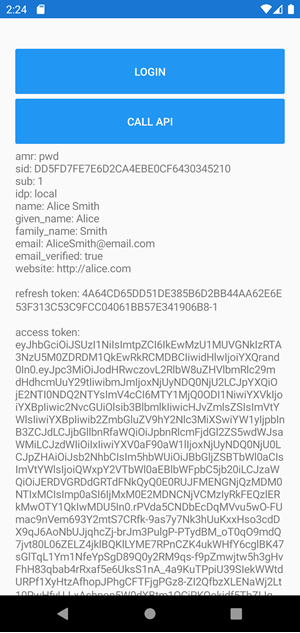
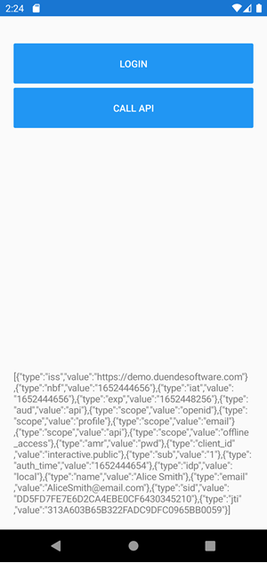

# 1.SimpleLogin

## Beskrivelse
Demonstrerer den simpleste måde at benytte IdentityServer til at lave login på en Xamarin Form app.

Når brugeren er logget ind, vises en velkomst, ID Token, Access Token og brugerens claims Bemærk at alle data også udskrives til Output vinduet når
man kører i Debug mode. Det giver mulighed for at kopiere Access Token over i f.eks [jwt.io](jwt.io) for nærmere inspektion.

Eksemplet benytter `IdentityModel.OidcClient` og ikke Auth0's egen udgave, fordi den ikke håndterer at fjerne login pagen korrekt.

Her ses et eksempel af demo.duendesoftware.com som identityprovider, hvor der anvendes følgende konfiguration:

```c#
var options = new OidcClientOptions
{
    Authority = "https://demo.duendesoftware.com",
    ClientId = "interactive.public",
    Scope = "openid profile email api offline_access",
    RedirectUri = "com.companyname.auth0xamforms://callback",
    Browser = browser
};
```

BaseAdress: https://demo.duendesoftware.com

API kald: *api/test*

I næste afsnit forklares hvordan man i stedet for benytter Auth0:


.........
&nbsp;

## Oprettelse i Auth0

I stedet for Duende IdentityServer, er det nemmere at anvende Auth0:

Opret en ny Application og giv den et navn.

Vælg *Application Type* som **Native**

Under *Quick Start* kan man vælge **Xamarin**, hvor man kan få hjælp til konfigurationen. Her finder man bl.a. hvordan *Callback URL* skal formateres, her vist for Android:

`YOUR_ANDROID_PACKAGE_NAME://YOUR_DOMAIN_NAME/android/YOUR_ANDROID_PACKAGE_NAME/callback`

Man finder YOUR_ANDROID_PACKAGE_NAME i manifestet. YOUR_DOMAIN_NAME bliver automatisk indsat i Quick start.

Der er også en knap DOWNLOAD SAMPLE og VIEW ON GITHUB, men disse eksempler går på native Xamarin og ikke Xamarin.Forms. Benyt lærerens eksempel i stedet for.

&nbsp;

## Core projektet

Tilføj Nuget pakken:
- IdentityModel.OidcClient, version 5.0.0

&nbsp;

## Android

Tilføj Nuget pakken: 
- Plugin.CurrentActivity, version 2.1.0.4

Tilføj`LaunchMode = LaunchMode.SingleTask` til MainActivity attributes. 

Tilføj følgende til OnCreate(): `DependencyService.Register<ChromeCustomTabsBrowser>();` og
`CrossCurrentActivity.Current.Init(this, savedInstanceState);`

Tilføj klassen `ChromeCustomTabsBrowser`, der implementerer `IBrowser`

Tilføj klassen `OidcCallbackActivity`, der nedarver fra `Activity`. Husk at tilrette *DataScheme* så det passer med `package` fra manifestet!

&nbsp;

## iOS

Tilføj Nuget pakkerne:
- System.Text.Encodings.Web, version 6.0.0
- IdentityModel.OidcClient, version 5.0.0

Tilføj klassen `ASWebAuthenticationSessionBrowser`, der implementerer `IBrowser`

Tilføj følgende til AppDelegatee.cs:  `DependencyService.Register<ASWebAuthenticationSessionBrowser>();`

I Info.plist tilføjes følgende i slutningen af `</dict>`, hvor package navnet fra manifestet benyttes:

```xml
<key>CFBundleURLTypes</key>
<array>
	<dict>
		<key>CFBundleURLSchemes</key>
		<array>
			<string>auth0xamforms</string>
		</array>
	</dict>
</array>
```

